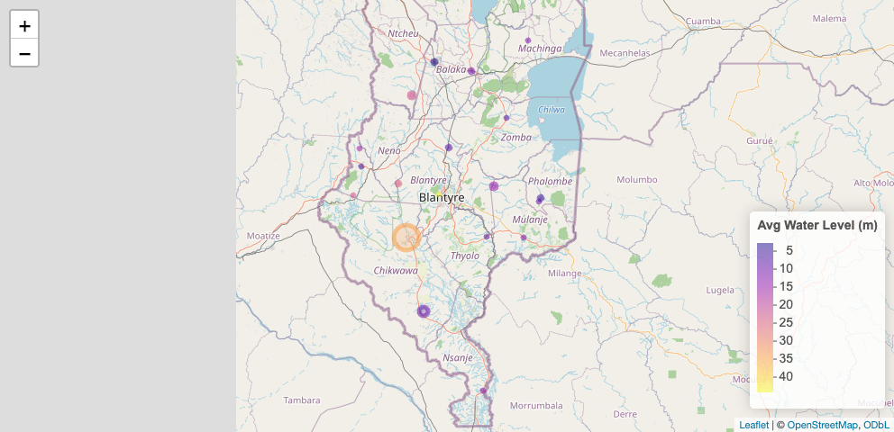

# Malawi Groundwater Monitoring Time-Series Dataset (2024–2025)

[](https://doi.org/10.5281/zenodo.18798409)

[](https://zenodo.org/doi/10.5281/zenodo.18798409)
[](https://github.com/openwashdata/mwgroundwaterdata/actions/workflows/R-CMD-check.yaml)

This dataset contains groundwater monitoring data collected from
monitoring wells across 9 districts in Malawi between 2024 and 2025. The
data were captured using automated data loggers installed in monitoring
wells and were collected and managed by BASEflow.

The dataset provides time-series measurements of key groundwater
parameters, enabling detailed analysis of aquifer behavior across
multiple geographic locations.

Variables Included

- Date – Date of measurement

- Waterpoint Name – Name of the monitoring site

- District – Administrative district where the monitoring well is
  located

- Latitude & Longitude – Geographic coordinates of the monitoring well

- Source – Data collection method (automated data logger)

- Water Level – Groundwater level measurement (typically meters below
  ground level, depending on installation reference)

- Temperature – Groundwater temperature (°C)

- Conductivity – Electrical conductivity (µS/cm), indicating dissolved
  ion concentration and groundwater quality characteristics

The use of automated loggers ensures high-frequency, consistent, and
reliable measurements suitable for time-series analysis and
hydrogeological assessment.

1.  **Purpose and Use Cases 1. Groundwater Resource Monitoring**

- Tracking spatial and temporal groundwater level variations across
  districts

- Assessing seasonal recharge and depletion patterns

- Identifying long-term aquifer trends

2.  **Water Quality Surveillance**

- Monitoring conductivity trends as a proxy for salinity and
  mineralization

- Detecting potential contamination or quality shifts

3.  **Climate and Drought Analysis**

- Supporting drought early warning systems

- Evaluating groundwater resilience to climate variability

4.  **Infrastructure Management**

- Informing borehole design and pump installation depths

- Supporting preventive maintenance planning

- Assessing borehole performance over time

5.  **Hydrogeological Research and Modelling**

- Input data for groundwater flow and recharge models

- Calibration of aquifer simulations

- Comparative inter-district hydrogeological analysis

6.  **Policy, Regulation, and Planning**

- Evidence base for district-level and national water resource planning

- Supporting groundwater abstraction regulation

- Informing investment decisions in rural and urban water supply

**Potential Users**

- Ministry responsible for Water and district water offices

- Hydrologists and hydrogeologists

- WASH sector NGOs and implementing partners

- Academic and research institutions

- Climate and environmental analysts

- Development partners supporting water security and resilience programs

This dataset provides a structured, multi-district groundwater evidence
base to support sustainable groundwater management and water security
planning in Malawi.

## Installation

You can install the development version of mwgroundwaterdata from
[GitHub](https://github.com/) with:

``` r

# install.packages("devtools")
devtools::install_github("openwashdata/mwgroundwaterdata")
```

``` r

## Run the following code in console if you don't have the packages
## install.packages(c("dplyr", "knitr", "readr", "stringr", "gt", "kableExtra"))
library(dplyr)
library(knitr)
library(readr)
library(stringr)
library(gt)
library(kableExtra)
```

Alternatively, you can download the individual datasets as a CSV or XLSX
file from the table below.

1.  Click Download CSV. A window opens that displays the CSV in your
    browser.
2.  Right-click anywhere inside the window and select “Save Page As…”.
3.  Save the file in a folder of your choice.

| dataset | CSV | XLSX |
|:---|:---|:---|
| mwgroundwaterdata | [Download CSV](https://github.com/openwashdata/mwgroundwaterdata/raw/main/inst/extdata/mwgroundwaterdata.csv) | [Download XLSX](https://github.com/openwashdata/mwgroundwaterdata/raw/main/inst/extdata/mwgroundwaterdata.xlsx) |

## Data

The package provides access to This dataset contains groundwater
monitoring data collected from monitoring wells across 9 districts in
Malawi between 2024 and 2025. The data were captured using automated
data loggers installed in monitoring wells and were collected and
managed by BASEflow.

``` r

library(mwgroundwaterdata)
```

### metadata

The dataset `mwgroundwaterdata` contains 1415 observations and 9
variables

``` r

mwgroundwaterdata |> 
  head(3) |> 
  gt::gt() |>
  gt::as_raw_html()
```

| date | waterpoint_name | district | latitude | longitude | source | water_level | temperature | conductivity |
|---:|:---|:---|---:|---:|:---|---:|---:|---:|
| 31/12/2024 | Balaka Water Office | Balaka | -14.9923 | 34.95948 | Logger | 3.1000 | 27.415 | 896.8 |
| 31/12/2024 | Balaka Water Office | Balaka | -14.9923 | 34.95948 | Logger | 2.7012 | 27.415 | 895.8 |
| 1/1/2025 | Balaka Water Office | Balaka | -14.9923 | 34.95948 | Logger | 3.3367 | 27.416 | 895.7 |

For an overview of the variable names, see the following table.

| variable_name | variable_type | description |
|:---|:---|:---|
| date | character | Date when data was captured |
| waterpoint_name | character | The name of the water point |
| district | character | Administrative district the water point is located |
| latitude | numeric | GPS latitude coordinate |
| longitude | numeric | GPS longitude coordinate |
| source | character | The device that captured the information |
| water_level | numeric | Water level of the water |
| temperature | numeric | Temperature of the data |
| conductivity | numeric | Electical conductivity of the water |

## Example

``` r

library(mwgroundwaterdata)

# Visualization: Geospatial Map
# Import the libraries to be used
library(tidyverse)
library(lubridate)
library(leaflet)

# Create summary dataset INSIDE the README
well_summary <- mwgroundwaterdata %>%
  group_by(waterpoint_name, latitude, longitude, district) %>%
  summarise(
    avg_water_level = mean(water_level, na.rm = TRUE),
    avg_conductivity = mean(conductivity, na.rm = TRUE),
    .groups = "drop"
  )

leaflet(well_summary) %>%
  addTiles() %>%  # OpenStreetMap tiles
  addCircleMarkers(~longitude, ~latitude,
                   radius = ~avg_conductivity/400,
                   color = ~colorNumeric("plasma", avg_water_level)(avg_water_level),
                   popup = ~paste0(waterpoint_name, "<br>Avg Water Level: ", round(avg_water_level,2),
                                   "<br>Avg Conductivity: ", round(avg_conductivity,1))) %>%
  addLegend("bottomright",
            pal = colorNumeric("plasma", well_summary$avg_water_level),
            values = well_summary$avg_water_level,
            title = "Avg Water Level (m)")
```



## License

Data are available as
[CC-BY](https://github.com/openwashdata/mwgroundwaterdata/blob/main/LICENSE.md).

## Citation

Please cite this package using:

``` r

citation("mwgroundwaterdata")
#> To cite package 'mwgroundwaterdata' in publications use:
#> 
#>   Mhango E (2026). "mwgroundwaterdata: Malawi Groundwater Monitoring
#>   Time-Series Dataset (2024–2025)." doi:10.5281/zenodo.18798409
#>   <https://doi.org/10.5281/zenodo.18798409>.
#>   <https://github.com/openwashdata/mwgroundwaterdata>.
#> 
#> A BibTeX entry for LaTeX users is
#> 
#>   @Misc{mhango:2026,
#>     title = {mwgroundwaterdata: Malawi Groundwater Monitoring Time-Series Dataset (2024–2025)},
#>     author = {Emmanuel Mhango},
#>     year = {2026},
#>     doi = {10.5281/zenodo.18798409},
#>     url = {https://github.com/openwashdata/mwgroundwaterdata},
#>     abstract = {This dataset contains groundwater monitoring data collected from monitoring wells across 9 districts in Malawi between 2024 and 2025. The data were captured using automated data loggers installed in monitoring wells and were collected and managed by BASEflow. The dataset provides time-series measurements of key groundwater parameters, enabling detailed analysis of aquifer behavior across multiple geographic locations.},
#>     keywords = {open data,washdata,groundwater,groundwater monitoring,water level,water quality,Malawi,sanitation,wash,water,watermonitoring},
#>     version = {0.0.2},
#>   }
```
